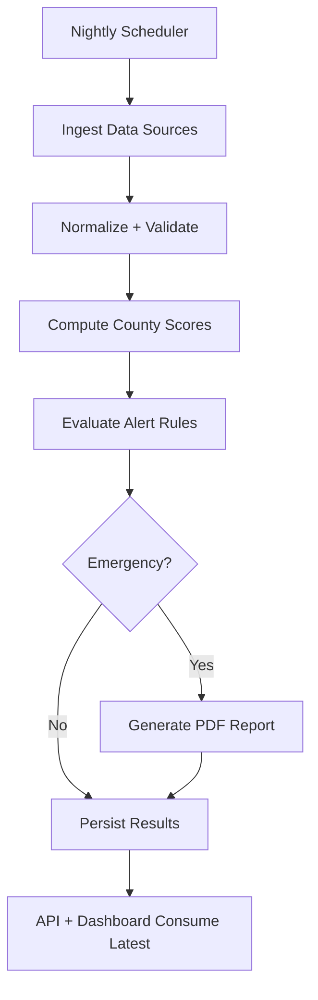

# MAJI Sentinel — Water & Sanitation Intelligence for Kenya

## 1. Product Overview
MAJI Sentinel is a county-level intelligence platform that turns Kenya’s open water and sanitation data into daily, decision-ready signals.
- Helps county governments, regulators, NGOs, utilities, and researchers monitor access, sanitation, water quality, utility performance, governance readiness, and climate resilience across all 47 counties.

## 2. Core Features

### 2.1 User Roles
| Role | Registration Method | Core Permissions |
|------|---------------------|------------------|
| Public Viewer | None | View dashboard, map layers, scores, exports, API docs |
| Operator (API Key) | API key | Resolve alerts, trigger recompute, manage data refresh runs |

### 2.2 Feature Modules
1. **Intelligence Map Dashboard**: choropleth scores + key layers + county drill-down.
2. **County Briefing**: score cards, trends, drivers, data provenance, exports.
3. **Water Point Intelligence**: searchable water points, functionality, density metrics, nearest lookup.
4. **Alerts & Reports**: Watch/Warning/Emergency feed, resolve workflow, Emergency auto PDF.
5. **Data & Exports**: datasets catalog, freshness, CSV exports.
6. **API & Developer Portal**: OpenAPI docs, examples, rate limits, API key notes.

### 2.3 Page Details
| Page Name | Module Name | Feature Description |
|-----------|-------------|---------------------|
| Dashboard | KPI header | National summary (median composite, counties in Watch/Warning/Emergency, last refresh) |
| Dashboard | Interactive map | County choropleth by selected score; layer toggles (water points, sanitation hotspots, catchments, utilities) |
| Dashboard | County quick view | Hover/click county shows mini scorecard + top drivers + link to County page |
| County | Score cards | Composite + sub-scores, thresholds, and score explanations |
| County | Trends | Time series for scores and key indicators (where available) |
| County | “Why this score?” | Top contributing indicators, data coverage note, last update per source |
| Water Points | Explorer table | Filter by county, type, functionality, last maintenance; export CSV |
| Water Points | Map focus | Click water point → details; “Nearest” query tool (lat/lng) |
| Alerts | Alert feed | Filter by severity; show triggers; resolve (API key) |
| Alerts | Emergency report | Download generated PDF; show generation timestamp and trigger metrics |
| Data | Sources catalog | Baseline + added sources; freshness status; provenance and licensing notes |
| Data | Exports | Scores CSV by year; water points CSV by county; API examples |
| API | Docs | Embedded Swagger UI (OpenAPI), curl examples, field definitions |

## 3. Core Process
### 3.1 User Flows (Natural Language)
- A user opens the Dashboard, chooses a score (Composite by default), and clicks a county to view a briefing with score drivers and water point coverage.
- An operator reviews the Alerts feed; if an alert is addressed, they resolve it using an API key and export evidence for reporting.
- During an Emergency, the system generates a PDF county report automatically and makes it available from the Alerts view and the API.

### 3.2 Flowchart

## 4. User Interface Design
### 4.1 Design Style
- Visual concept: “Cartographic field notebook” — dark-ink typography, paper-like panels, confident county colors, and data layers that read like an operations map.
- Primary colors: deep ink (#0B1220), lake blue (#1B66FF), clay (#C06A3B), safety amber (#F6B42C), emergency red (#E23B2E), paper (#F7F1E6).
- Typography: distinctive editorial display + highly readable body font; high contrast and generous spacing.
- Layout: desktop-first with a left navigation rail and a map-first main canvas; contextual drawers for details.
- Interaction: fast hover feedback; county selection persists in URL; layer toggles feel like mission controls.

### 4.2 Page Design Overview
| Page Name | Module Name | UI Elements |
|-----------|-------------|-------------|
| Dashboard | Map canvas | Full-height map, top score selector, layer toggles, legend, county tooltip drawer, subtle grain background |
| County | Briefing | Scorecard grid, trend charts, “drivers” list, data freshness panel, export buttons |
| Water Points | Explorer | Split view map/table, filter bar, point detail drawer, nearest lookup input |
| Alerts | Feed | Severity badges, rule triggers, resolve button, PDF download CTA for Emergency |
| Data | Catalog | Source cards, freshness chips, coverage notes, link-out references |

### 4.3 Responsiveness
- Desktop-first optimized for 1920×1080.
- Works down to ~1280px width via collapsible nav and stacked panels; map remains primary.

## 5. Data Sources (Baseline + Added)
### 5.1 Baseline (Required)
- WASREB Impact Reports (annual indicators; PDF tables)
- Majidata public dashboards (coverage and provider summaries where accessible)
- WRA permits + abstraction + catchments + water points (GIS layers)
- KNBS Census 2019 sanitation + water access (county)
- KNBS Housing Survey 2023/24 sanitation updates (county)
- WHO/UNICEF JMP Kenya files (service ladders)
- WRA water quality stations summaries (periodic)
- Ministry of Health DHIS2 (HisKenya) public aggregates for water indicators
- KEWASNET reports (periodic)
- Kenya admin boundaries (HDX)
- OSM hydrography (rivers/lakes)
- CHIRPS rainfall (raster time series)
- NDMA drought bulletins (monthly PDFs)
- Kenya Met seasonal forecasts (PDFs)

### 5.2 Added High-Value Sources (Minimum 5)
- Water Point Data Exchange (WPDx): water point locations + functionality metadata (where available)
- UNICEF Data: WASH indicators and subnational datasets (where available)
- World Bank WDI + Water-related indicators: contextual comparators for governance and financing signals
- Global Surface Water (JRC): surface water seasonality and change (resilience context)
- GRACE/GRACE-FO groundwater storage anomalies (regional proxy for groundwater stress)
- OpenAQ / or equivalent open water-quality repositories (only if Kenya coverage exists; optional ingestion)

## 6. Scoring & Alerts (High-Level)
- Nightly scores computed for each county on a 0–100 scale: Water Access, Sanitation Coverage, Water Quality, Utility Performance, Governance, Climate Resilience, Composite.
- Scores include data coverage checks; low coverage reduces confidence and is displayed.
- Alerts generated from score thresholds and indicator triggers (Watch/Warning/Emergency); Emergency triggers an automatic PDF county brief.

