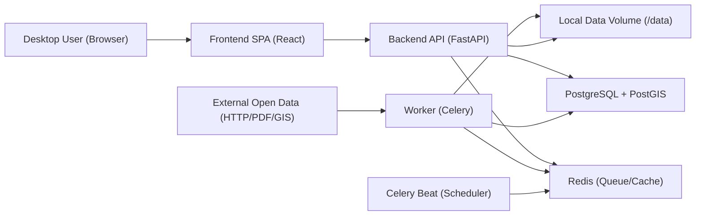
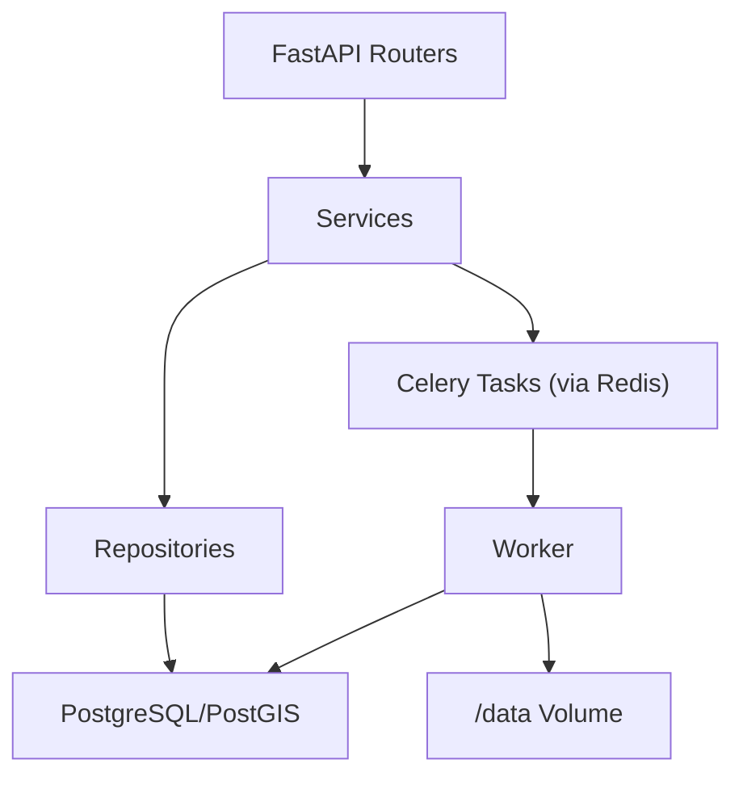
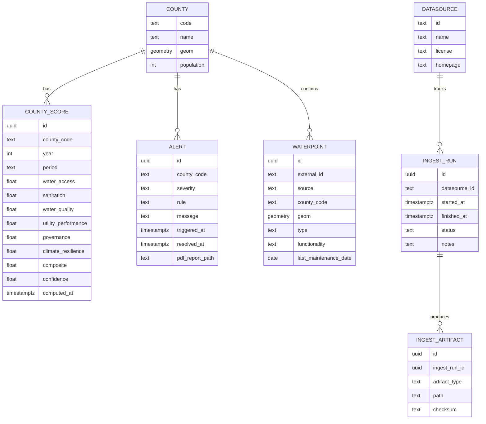

# MAJI Sentinel — Technical Architecture

## 1. Architecture Design


## 2. Technology Description
- Frontend: React + TypeScript + Vite, Tailwind CSS, MapLibre GL JS (vector maps), deck.gl (optional for heatmaps), TanStack Query for data fetching.
- Backend: Python + FastAPI + Pydantic, SQLAlchemy 2.x + Alembic migrations, GeoAlchemy2 for PostGIS.
- Database: PostgreSQL with PostGIS extension for spatial queries and geometry storage.
- Jobs: Celery (worker) + Celery Beat (nightly schedules), Redis as broker and cache.
- Data Ingestion: modular “connectors” that download and normalize source data into canonical tables; PDF extraction via pdfplumber/camelot where applicable; Geo ingestion via GDAL/ogr2ogr where needed.
- Reporting: HTML-to-PDF generation for Emergency alerts (WeasyPrint) with a consistent template.
- Deployment: Docker Compose with named volumes for DB, Redis, and `/data` (raw downloads + derived artifacts).

## 3. Route Definitions (Frontend)
| Route | Purpose |
|-------|---------|
| / | Map-first dashboard (scores + layers) |
| /county/:code | County briefing (scores, trends, drivers, exports) |
| /waterpoints | Water point explorer (map + table + nearest tool) |
| /alerts | Alerts feed + resolve + emergency PDFs |
| /data | Data sources catalog + exports |
| /api | Embedded OpenAPI / Swagger UI |

## 4. API Definitions (Backend)
### 4.1 Endpoint List
| Method | Endpoint | Purpose | Auth |
|--------|----------|---------|------|
| GET | /health | Service status | None |
| GET | /counties | Counties with GeoJSON geometry | None |
| GET | /scores/{county_code} | Latest scores for county | None |
| GET | /scores | Scores for year (or latest) | None |
| GET | /alerts | Active alerts | None |
| PATCH | /alerts/{id}/resolve | Resolve alert | API Key |
| GET | /export/scores | Export scores CSV | None |
| GET | /export/waterpoints | Export water points CSV | None |
| POST | /compute/scores | Manual trigger compute + alerts | API Key |
| POST | /lookup/waterpoint | Nearest water point lookup | None |

### 4.2 Auth
- API key passed as `X-API-Key` header for protected endpoints.
- Single key stored in backend environment; can be rotated by editing `.env`.

### 4.3 Type Schemas (Representative)
```ts
export type County = {
  code: string
  name: string
  geom: GeoJSON.Polygon | GeoJSON.MultiPolygon
}

export type CountyScore = {
  county_code: string
  year: number
  period: string
  water_access: number
  sanitation: number
  water_quality: number
  utility_performance: number
  governance: number
  climate_resilience: number
  composite: number
  confidence: number
  computed_at: string
}

export type Alert = {
  id: string
  county_code: string
  severity: "watch" | "warning" | "emergency"
  rule: string
  message: string
  triggered_at: string
  resolved_at: string | null
  pdf_report_path: string | null
}
```

## 5. Server Architecture Diagram


## 6. Data Model
### 6.1 ER Diagram


### 6.2 Data Definition Language (Core Tables)
```sql
CREATE EXTENSION IF NOT EXISTS postgis;

CREATE TABLE counties (
  code TEXT PRIMARY KEY,
  name TEXT NOT NULL,
  geom GEOMETRY(MULTIPOLYGON, 4326) NOT NULL,
  population INTEGER
);
CREATE INDEX counties_geom_gix ON counties USING GIST (geom);

CREATE TABLE waterpoints (
  id UUID PRIMARY KEY,
  external_id TEXT,
  source TEXT NOT NULL,
  county_code TEXT REFERENCES counties(code),
  geom GEOMETRY(POINT, 4326) NOT NULL,
  type TEXT NOT NULL,
  functionality TEXT,
  last_maintenance_date DATE
);
CREATE INDEX waterpoints_geom_gix ON waterpoints USING GIST (geom);
CREATE INDEX waterpoints_county_idx ON waterpoints (county_code);

CREATE TABLE county_scores (
  id UUID PRIMARY KEY,
  county_code TEXT NOT NULL REFERENCES counties(code),
  year INTEGER NOT NULL,
  period TEXT NOT NULL,
  water_access REAL NOT NULL,
  sanitation REAL NOT NULL,
  water_quality REAL NOT NULL,
  utility_performance REAL NOT NULL,
  governance REAL NOT NULL,
  climate_resilience REAL NOT NULL,
  composite REAL NOT NULL,
  confidence REAL NOT NULL,
  computed_at TIMESTAMPTZ NOT NULL
);
CREATE INDEX county_scores_county_period_idx ON county_scores (county_code, year, period);

CREATE TABLE alerts (
  id UUID PRIMARY KEY,
  county_code TEXT NOT NULL REFERENCES counties(code),
  severity TEXT NOT NULL,
  rule TEXT NOT NULL,
  message TEXT NOT NULL,
  triggered_at TIMESTAMPTZ NOT NULL,
  resolved_at TIMESTAMPTZ,
  pdf_report_path TEXT
);
CREATE INDEX alerts_active_idx ON alerts (severity, resolved_at) WHERE resolved_at IS NULL;
```

## 7. Nightly Jobs
- `ingest_all_sources`: runs connectors, stores artifacts, updates canonical tables.
- `compute_scores`: computes 0–100 sub-scores + composite for each county; writes `county_scores`.
- `evaluate_alerts`: creates Watch/Warning/Emergency alerts; deduplicates open alerts by rule/county.
- `generate_emergency_pdf`: for Emergency alerts only; writes PDF to `/data/reports/{id}.pdf` and stores path in `alerts`.

## 8. Performance & Reliability
- PostGIS GIST indexes for geometry and spatial lookups; county_code indexes for filtering.
- Backend cache for high-traffic endpoints (`/counties`, latest scores) using Redis.
- Idempotent ingestion and scoring runs; artifacts checksummed to prevent duplicate storage.
- Strict schema validation for incoming datasets; coverage metrics feed into `confidence` score.

